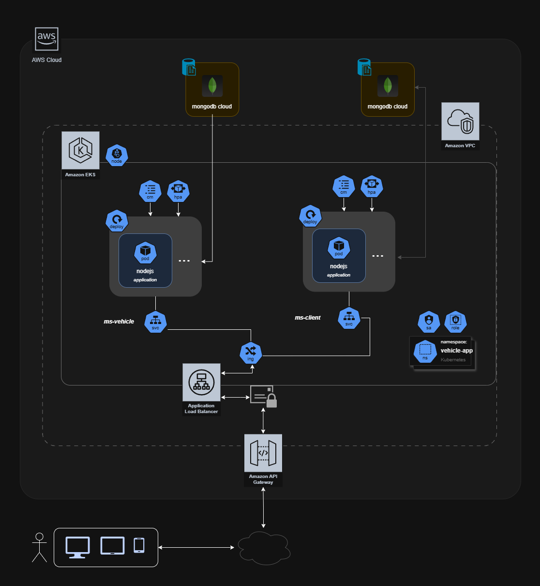

# FIAP - SOAT7 - Main
## VehicleAPI

## | 🖥️ • Architecture
### • Technologies
_Typescript, NodeJS, Mongo (Document DB)
### • Project structure - Clean Architecture
```
vehicle.postech.app
  ├── domain/                            # Camada I - Entities
  │   ├── models/                        # Definição de entidades
  │   │   ├── ...                        # Modelo para cada entidade
  │   │   └── vehicle.model.ts
  │   ├── entity/                        # Definição de interfaces para entidades
  │   │   ├── ...                        # Dependemos apenas de interfaces, nao de implementações
  │   │   └── vehicle.entity.ts
  │   ├── repository/                    # Definição de interfaces para repositories
  │   │   ├── ...                        # Dependemos apenas de interfaces, nao de implementações
  │   │   └── vehicle.repository.ts
  ├── usecases/                          # Camada II - Casos de uso
  │   ├── vehicle/                       # Separação por contextos 
  │   │   ├── ...                        # Use cases atomicos para cada fluxo, reutilizaveis
  │   │   └── vehicle.usecase.ts
  ├── application/                       # Camada III - Controllers, Presenters
  │   ├── controllers/                   # Orquestradores
  │   │   └── vehicle/                      # Separação por contextos 
  │   │       ├── ...
  │   │       └── vehicle.controller.ts
  │   └── presenters/                    # Mapeadores
  │       └── vehicle.presenter.ts          
  ├── adapter/                           # Camada IV - Drivers, frameworks
  │   ├── repositories/                  # Adaptador para persistencia em banco de dados
  │   │   └── orm.bootstrap.ts           
  │   │   └── product.repository.ts      
  │   ├── external/                      # Adaptadores para integrações externas e outros serviços
  │   │   └── client/
  │   │       └── xpto.ts      
  │   ├── cli/                           # Adaptador para execução da aplicação via CLI
  │   │   └── ...
  │   ├── http/                          # Adaptador para execução da aplicação HTTP
  │   │   └── ...
  │   └── ...
```


_Diagrama Clean Architecture - VehicleApp

### • Services
- [Client] - Serviço dedicado ao registro e autorização de clientes
- [Vehicle] - Serviço dedicado aos veículos - CRUD

## • Cloud Archtecture
Arquitetura baseada em serviços AWS

_Diagrama aplicação completa AWS_


## 🧪 Testing
### ⛏️ Unit testing
- Coveragem em cada repositorio de MS
- Minimo 80%
- Validação pipeline Pull Request
- Update automático readme.me depois do merge

## | ✉️ • Running v4
### • AWS
Implantado em: _(acesso AWS Academy ($))_
- ApiGateway: https://tyhvt3bsuj.execute-api.us-east-1.amazonaws.com/v4/*
- EC2: http://ec2-52-207-196-142.compute-1.amazonaws.com:30003/ [direto ao eks para testes]

### • DOCKER (local env, development)
1 - Run bash `./dev` inside infrastrure repo

Versão docker para desenvolvimento local:
Client MS, Vehicle MS, databases e nginx proxy.
```sh
# all repositories must be in an up enclosing folder
./dev.sh
```
2 - Done :)
```
http://localhost:3000/[microservice]/[endpoint] #proxy [ingress]
http://localhost:3001/docs # vehicle [ms]
http://localhost:3002/docs # client [ms]
```
